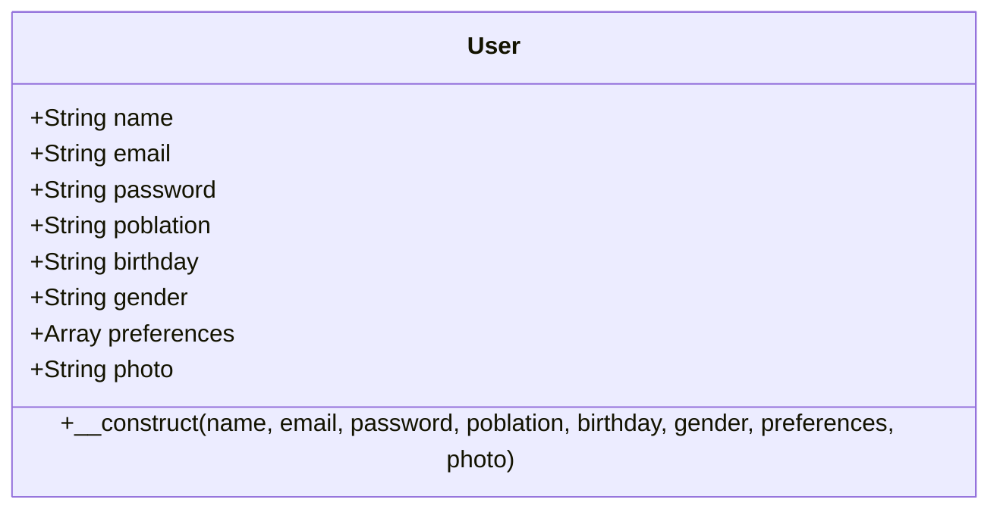
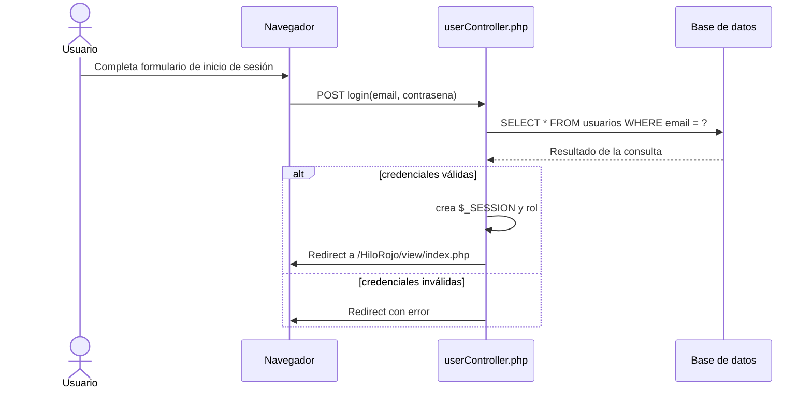
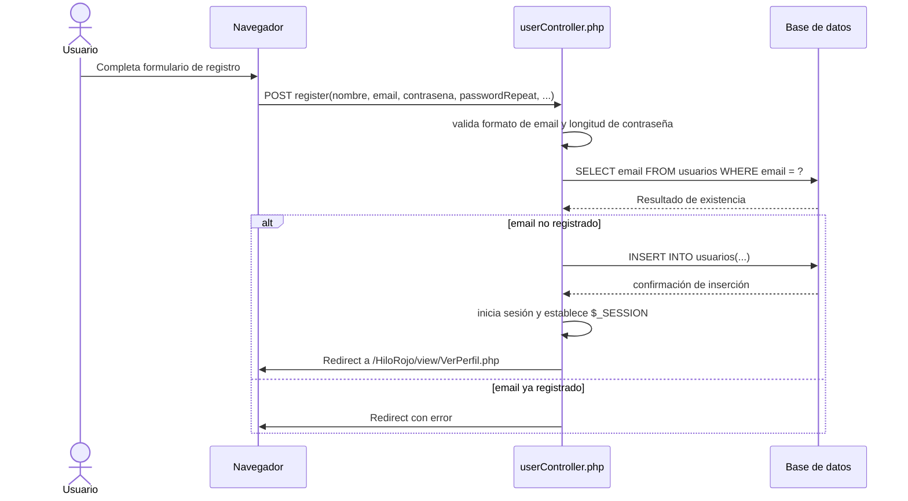

# El Hilo Rojo

## Introducción

El Hilo Rojo es una plataforma web de citas y eventos sociales desarrollada en PHP. Permite a usuarios registrarse, iniciar sesión y acceder a eventos exclusivos. El proyecto utiliza un modelo `User`, un controlador `UserController` y múltiples formularios en `view/formularios/` para gestionar el flujo de autenticación y perfil.

## Funcionalidades

- Registro de usuario con nombre, email, contraseña, población, fecha de nacimiento, género y preferencias.
- Inicio de sesión mediante email y contraseña.
- Cierre de sesión seguro.
- Control de acceso a páginas restringidas para usuarios autenticados.
- Redirección a páginas de eventos solo si el usuario está conectado.
- Detección de rol de usuario (`user` o `company`) basada en los datos registrados.
- Perfil de usuario con información personal y eventos destacados.

## Cómo funciona

El flujo principal está controlado por `controller/userController.php`.

1. El usuario abre el formulario de registro `view/formularios/formulario_crear_usuario.html` y envía sus datos.
2. El controlador crea una sesión, valida el email y la contraseña, y registra el usuario en la base de datos.
3. Si el registro es exitoso, el sistema inicia sesión automáticamente y redirige a `view/VerPerfil.php`.
4. Para iniciar sesión, el usuario usa `view/formularios/formulario_inicio_sesion_usuario.php`.
5. El controlador valida las credenciales consultando la tabla `usuarios` de la base de datos.
6. Si el acceso es correcto, el sistema establece variables de sesión y redirige al usuario a `view/index.php`.
7. Para ver eventos, se utiliza `controller/userController.php?action=ver_evento&pagina=evento_ejemploX`; el acceso se valida con `verificarAcceso()`.

### Diagrama de flujo: Ciclo de vida de una petición de usuario

```mermaid
flowchart TD
    U[Usuario] -->|Abre formulario| B[Navegador]
    B -->|POST login/register| C[UserController.php]
    C -->|Validar datos| V[Validaciones]
    V -->|Email y contraseña| D[Base de datos]
    D -->|Consulta/Inserción| C
    C -->|Establece $_SESSION| S[Sesión]
    C -->|Redirige| R[Vista final]
    R -->|Página| U

    subgraph AuthFlow [Flujo de autenticación]
      C -->|login| L[Login lógico]
      C -->|register| Rg[Registro lógico]
    end

    subgraph AccessFlow [Flujo de acceso a eventos]
      U -->|Navega a evento| E[GET ver_evento]
      E --> F[verificarAcceso()]
      F -->|Autenticado| G[Redirige a evento]
      F -->|No autenticado| H[Redirige a login]
    end
```

### Diagrama de clases: User



### Diagrama de secuencia: Login



### Diagrama de secuencia: Registro



## Archivos clave

- `model/User.php`: definición de la clase del usuario.
- `controller/userController.php`: lógica de registro, login, logout y acceso a eventos.
- `view/formularios/formulario_crear_usuario.html`: formulario de registro.
- `view/formularios/formulario_inicio_sesion_usuario.php`: formulario de inicio de sesión.
- `view/VerPerfil.php`: página de perfil de usuario.

## Notas adicionales

- La conexión a la base de datos se establece en `UserController::__construct()` con MySQLi.
- El controlador redirige a páginas de evento ubicadas en `view/eventos/` solo si el usuario está autenticado.
- El proyecto puede mejorarse añadiendo hashing de contraseñas y validación server-side más robusta.

